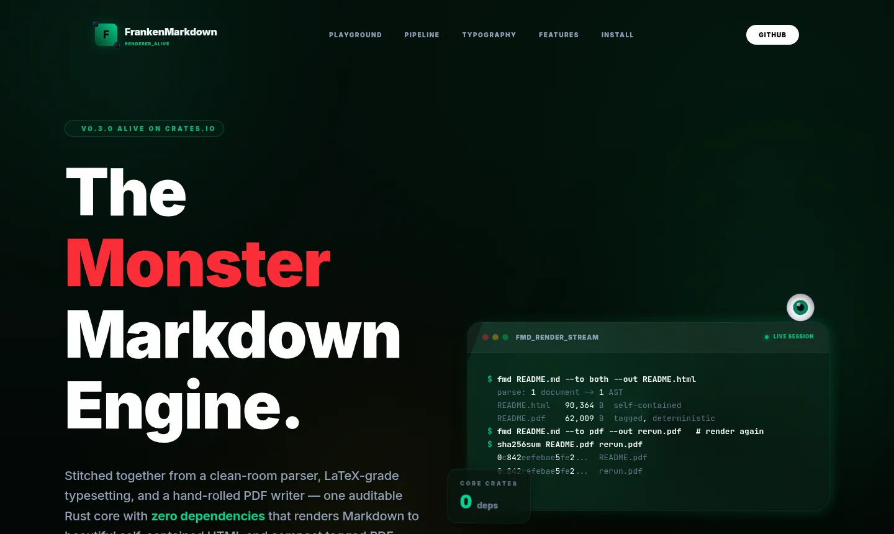
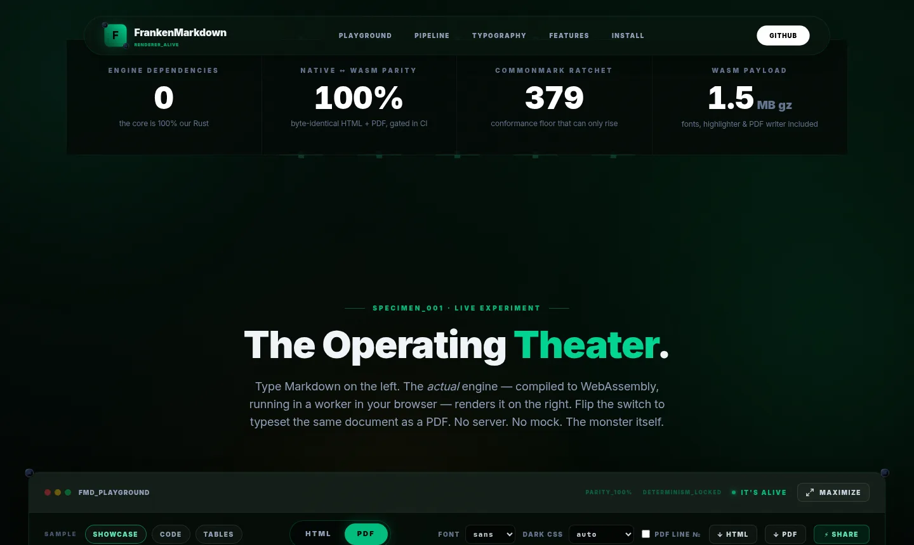
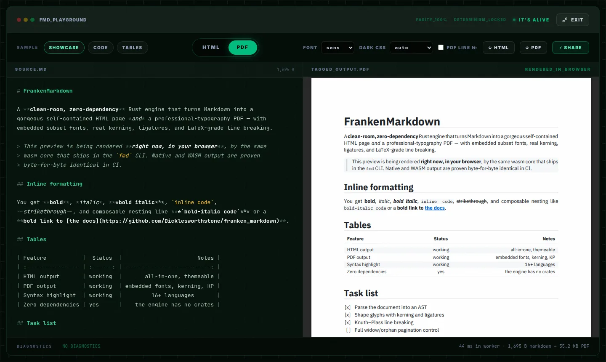
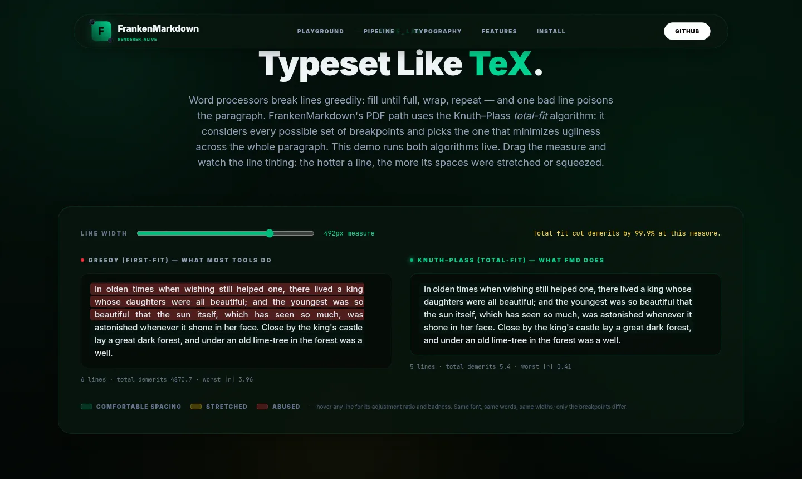

<div align="center">

# The FrankenMarkdown Website



**The static demo site for [FrankenMarkdown](https://github.com/Dicklesworthstone/franken_markdown)
(`franken_markdown`), live at [franken-markdown.com](https://franken-markdown.com): a two-pane
playground where the real engine, compiled to WebAssembly, renders your Markdown to
polished HTML and typeset PDF entirely in your browser.**

[](https://franken-markdown.com)

[](https://www.npmjs.com/package/@franken-suite/franken-markdown)
[](https://crates.io/crates/franken_markdown)


**Try it:** [the playground](https://franken-markdown.com/#playground) ·
[maximized, full-page](https://franken-markdown.com/#view=max) ·
[a document shared inside a URL](https://franken-markdown.com/#view=max&zdoc=HYwxDsJADAT7vGIluohQIZ6AKIACwQNMvHCnXGzkS4j4PYJ2NDMrHFiK4xE-QnC7HJvmmnLFkrwQ6v080ibkipf0AxVtm61mJaZElGxD26KD8lFkoq5xl8rddo7S0XrXHxJTBLugKYOK--cf70NsoJ0kBvXFsEgdQXtmI9zw8TkwSp-ycYOzTynb8ydhfhWX_5lvxqb5Ag)

</div>

---

## TL;DR

**The problem.** Markdown-renderer demos usually cheat: a canned screenshot, a
server that renders for you, or a JavaScript lookalike library that isn't the
real engine. None of that proves anything about the actual renderer.

**The solution.** The playground here runs the actual FrankenMarkdown core,
compiled to WebAssembly and hosted in a Web Worker: the same clean-room Rust
parser, Knuth–Plass layout engine, font subsetter, and PDF writer that power
the `fmd` CLI. CI proves the wasm build renders byte-identical output to the
native binary. The site itself is plain static files: no framework, no build
step at deploy time, no backend, no analytics, no CDN dependencies.

### What's on the site

| Feature | Details |
|---|---|
| Two-pane playground | Syntax-highlighted Markdown editor on the left, live rendered output on the right |
| HTML ⇄ PDF toggle | The same document as a self-contained HTML page or a typeset, tagged PDF, one click apart |
| Maximize mode | Full-page operating theater; `Esc` exits; deep-linkable via `#view=max` |
| Serverless sharing | The **Share** button packs your document *into the URL itself* (deflate + base64url); no hosting, no upload |
| Title-derived downloads | `# My Great Doc!` downloads as `my_great_doc.html` / `my_great_doc.pdf` |
| Real-algorithm visualizations | Greedy vs. Knuth–Plass line breaking (both actually run in JS), pipeline explorer, font-subsetting glyph grid, dependency-graph comparison |
| Render telemetry | Worker render times, output byte counts, and structured parser diagnostics, live |

<div align="center">

| PDF pane | Maximized (`#view=max`) |
|---|---|
|  |  |



</div>

---

## The URL-Sharing Format

Share links look like `https://franken-markdown.com/#view=max&zdoc=HYwxDsJADAT7...`
and are built entirely client-side:

| Fragment param | Meaning |
|---|---|
| `zdoc=<payload>` | The document: UTF-8 → `deflate-raw` → base64url (preferred; roughly 3× smaller) |
| `doc=<payload>` | The document: UTF-8 → base64url (fallback when `CompressionStream` is unavailable) |
| `view=max` | Open the playground maximized, occupying the full page |
| `fmt=pdf` | Start on the PDF pane instead of HTML |

Why the `#` fragment and not a query string? **Fragments are never sent to the
server.** Your document doesn't appear in any request, log, or cache; it
travels inside the link and is decoded and re-rendered locally by the wasm
engine on the recipient's machine. There is nothing to host and nothing to
delete later. Links up to roughly 30k characters travel well in modern
browsers, and the Share button warns beyond that.

---

## Quick Start (local development)

```bash
git clone https://github.com/Dicklesworthstone/franken_markdown_website
cd franken_markdown_website

bun install          # only needed for CSS rebuilds + tests
bun run serve        # http://localhost:8899 (any static server works)
```

Modules + WASM require http(s); opening `index.html` via `file://` will not work.

```bash
bun run css          # recompile dev/tailwind.css -> assets/css/site.css
bun run css:watch    # ...continuously
```

### Testing

| Command | What it proves |
|---|---|
| `bun run test` | 28-check headless e2e (Chromium) against localhost — playground renders, toggles, downloads, share round-trips, maximize, all four visualizations, no console errors, no font rejects, desktop chrome intact |
| `bun run test:live` | The same suite against franken-markdown.com |
| `bun run verify:live` | sha256-compares every asset the live page references (including the module/worker/wasm import chain) against the local tree — catches stale edge entries and forgotten `?v=` bumps |
| `bun run test:stress` | Blocks the wasm binary (must surface `WASM FAILED`, never hang) and hammers 12 rounds of interleaved typing + format toggles (must end consistent) |
| `bun run smoke:firefox` / `bun run smoke:webkit` | Gecko / JavaScriptCore passes against production (needs `bunx playwright install firefox` / `webkit` once); Firefox runs with pdf.js off, exercising the PDF fallback path |

The compiled `assets/css/site.css` is committed, so deployment never needs
Node/Bun; the deployable site is pure static files.

---

## Repo Layout

```
index.html                  the whole site (single page, scroll narrative)
assets/css/site.css         compiled Tailwind v4 + custom design system (committed)
assets/js/main.js           chrome: header, reveals, glitch text, monster eye, hero terminal
assets/js/playground.js     two-pane editor, HTML/PDF toggle, maximize, share, downloads
assets/js/render-worker.js  module Web Worker hosting the wasm renderer
assets/js/md-highlight.js   editor-overlay markdown highlighter
assets/js/viz.js            pipeline / Knuth-Plass / subsetting / dependency visualizations
assets/wasm/<version>/      @franken-suite/franken-markdown (wrapper + wasm-bindgen glue + .wasm);
                            version-named so the trio updates atomically (see Refreshing below)
assets/fonts/               self-hosted Inter + JetBrains Mono (latin variable woff2, 87 KB total)
dev/tailwind.css            CSS source (tokens, materials, keyframes)
dev/*.mjs                   e2e suite + screenshot/OG-image tooling (playwright-core)
screenshots/                README images, captured from production
_headers                    Cloudflare Pages headers (see the caching note inside)
.nojekyll                   keeps GitHub Pages from running Jekyll
```

---

## How the Playground Works

```
        keystrokes                    postMessage                 rendered bytes
editor ───────────────▶ playground.js ───────────▶ render-worker.js ─────────────▶ UI
(textarea + overlay      debounce 170ms,            franken_markdown.wasm          HTML → <iframe srcdoc>
 highlighter, exact       coalesce per format        (parser, theme, layout,        PDF  → Blob URL → <iframe>
 char-for-char match)     latest-wins                fonts, DEFLATE, PDF writer)    bytes are transferred,
                                                     runs OFF the main thread       not copied
```

- At most one render per format is in flight; if you keep typing, the worker
  re-renders once more with the latest text, so no queue builds up.
- HTML previews render in a sandboxed iframe. PDFs use the browser's native
  inline viewer, with an "open PDF" fallback where inline viewing is
  unavailable (most mobile browsers).
- Output bytes come back as transferable `ArrayBuffer`s, not copies.

---

## Deploying

**Cloudflare Pages** (how franken-markdown.com is deployed):

```bash
mkdir -p dist && cp -r index.html assets _headers robots.txt .nojekyll dist/
wrangler pages deploy dist --project-name franken-markdown --branch main
```

**GitHub Pages:** Settings → Pages → deploy from branch, folder `/ (root)`.
`.nojekyll` is already present; GitHub serves `.wasm` with the correct MIME type.

The site is **not** Git-connected to Pages (`Git Provider: No`). Production
updates are `wrangler pages deploy`, not a GitHub push. Last production
engine bump: **0.3.5** (2026-08-28), `assets/wasm/0.3.5/`, worker cache-bust
`playground.js?v=8`. Artifact sha256
`1da66d986365f627dce8a05483feb9c2d2d9d45a29e4474fbd057e01abe83662`
(raw 4,028,677; gzip 1,803,496; live `Content-Encoding: br`).

**A hard-won caching note:** `_headers` deliberately serves assets with
`max-age=0, must-revalidate` (cheap ETag 304s) instead of long TTLs. These
URLs are not content-fingerprinted, and long edge TTLs outlive Cloudflare
Pages' deploy purge on custom domains; during development, a fresh browser
received the previous deploy's JavaScript from the edge cache. If you want
long TTLs, fingerprint the filenames first.

Two more sharp edges, both observed in production:

- The zone's Browser Cache TTL setting rewrites `max-age=0` upward (to 14400
  here), so browsers may hold an asset for hours without revalidating.
- Requests made moments after a deploy can be answered during the deploy's
  propagation window and cached under the *previous* deploy's header config
  (that is how one stylesheet URL got pinned for a day with stale content).

Consequence: **whenever an asset's content changes, bump its `?v=` query in
`index.html`** (and in module import specifiers if the file is imported).
The e2e suite's desktop-chrome check exists to catch a stale stylesheet.

After deploying, verify **content**, not headers — a header poll is satisfied
by the previous deployment during the propagation window:

```bash
until bun run verify:live; do sleep 10; done   # sha-compares every live asset
bun dev/e2e.mjs https://franken-markdown.com/  # then the full suite
```

---

## Refreshing the WASM Artifacts

The site ships the same package that is published to npm as
[`@franken-suite/franken-markdown`](https://www.npmjs.com/package/@franken-suite/franken-markdown).
It is built and verified by the engine repo's official gate (native ↔ wasm
byte parity + size budget):

```bash
cd ../franken_markdown
scripts/check-wasm-package.sh <run-id>
V=<engine-version>   # e.g. 0.3.1
mkdir -p ../franken_markdown_website/assets/wasm/$V/pkg
cp target/fmd-checks/wasm-package/franken_markdown.{js,d.ts}  ../franken_markdown_website/assets/wasm/$V/
cp target/fmd-checks/wasm-package/pkg/franken_markdown.js      ../franken_markdown_website/assets/wasm/$V/pkg/
cp target/fmd-checks/wasm-package/pkg/franken_markdown_bg.wasm ../franken_markdown_website/assets/wasm/$V/pkg/
```

Or, after the gate:

```bash
dev/refresh-engine-wasm.sh           # copies into assets/wasm/<version>/ + bumps ?v=
dev/refresh-engine-wasm.sh --deploy  # then wrangler pages deploy
```

Then point the import in `assets/js/render-worker.js` at the new directory and
bump the worker URL `?v=` in `assets/js/playground.js` (the helper does both).
The bundle lives in a version-named directory so the wrapper, glue, and binary
always update as one unit; an edge cache can never pair an old glue file with a
new binary.

**Do not `wasm-opt` this module for transfer size.** On the 0.3.5
`bg.wasm`, `-Oz` / `-O4` / `-Os` shrank raw by ~117 KB but **grew** gzip and
brotli (~8–10 KB). Pages already brotli-encodes; the transfer-optimal ship is
the wasm-bindgen output as-is.

Never copy an unverified build; the whole point of the playground is that it
runs the parity-gated engine. The helper also writes a local staging copy
under `dev/engine-wasm/<version>/` (gitignored) so a later agent can finish
the `assets/wasm/` copy if that tree is locked.

---

## Troubleshooting

| Symptom | Fix |
|---|---|
| Blank page from `file://` | ES modules + wasm need http(s): `bun run serve` |
| Playground stuck on `REANIMATING…` | The ~1.8 MB (gzipped) wasm module is still downloading, or the browser blocks module workers; check the diagnostics strip |
| PDF pane shows an "open PDF" button instead of a preview | That browser (most mobile ones) can't inline PDFs; the button opens/downloads the same bytes |
| Share says "Link in address bar" instead of "Link copied" | Clipboard permission was denied; the URL in the address bar is the share link |
| Edits to `index.html` classes don't take effect | Rebuild the compiled stylesheet: `bun run css` |
| Console warnings: `OTS parsing error` in the HTML preview | Emitted by the engine's embedded TTF subsets inside the preview iframe (engine-level; the preview falls back to system fonts) |

---

## Limitations

- **Share links are bounded by URL length.** Roughly 30k characters is the
  practical ceiling (deflate typically fits a few dozen KB of Markdown under
  it). Bigger documents belong in files, not URLs.
- **`doc=`/`zdoc=` are not encryption.** Base64url is encoding, not secrecy:
  anyone holding the link holds the document.
- **PDF inline preview needs a desktop-class viewer.** Mobile browsers get a
  fallback button, not an embedded page.
- **The visualizations are faithful but simplified.** The Knuth–Plass demo
  runs a real total-fit DP, but the engine's production implementation also
  handles hyphenation, penalties, and page-level concerns.

---

## FAQ

**Is my document uploaded anywhere when I click Share?**
No. The document is compressed and encoded into the URL fragment client-side.
Fragments are not sent in HTTP requests, and the site has no backend to send
them to anyway.

**Is the playground really the same engine as the `fmd` CLI?**
Yes. It is the identical Rust core compiled to `wasm32-unknown-unknown`,
shipped through a CI gate that fails unless wasm and native output are
byte-identical over a corpus.

**Why is the wasm module ~4 MB (1.8 MB gzipped, ~1.35 MB brotli)?**
It embeds everything: bundled fonts, the syntax highlighter, the layout
engine (including fmd-math), the SVG-to-PDF drawing path, and a hand-rolled
DEFLATE. There are no runtime downloads after it loads. Gzip is the
apples-to-apples figure vs older 0.3.2 (~3.3 MB raw / 1.5 MB gz); the live
host serves brotli.

**Can I use the renderer in my own page?**
`npm install @franken-suite/franken-markdown`, then
`const fmd = await createRenderer(); await fmd.renderPdf("# Hi")`. See the
[engine repo](https://github.com/Dicklesworthstone/franken_markdown) for the API.

**Why "FrankenMarkdown"?**
The engine is stitched together from hand-built organs (parser, highlighter,
font reader, line breaker, compressor, PDF writer) with zero third-party
crates in the render path. It's alive.

---

## About Contributions

Please don't take this the wrong way, but I do not accept outside contributions
for any of my projects. I simply don't have the mental bandwidth to review
anything, and it's my name on the thing, so I'm responsible for any problems it
causes; thus, the risk-reward is highly asymmetric from my perspective. I'd also
have to worry about other "stakeholders," which seems unwise for tools I mostly
make for myself for free. Feel free to submit issues, and even PRs if you want
to illustrate a proposed fix, but know I won't merge them directly. Instead,
I'll have Claude or Codex review submissions via `gh` and independently decide
whether and how to address them. Bug reports in particular are welcome. Sorry if
this offends, but I want to avoid wasted time and hurt feelings. I understand
this isn't in sync with the prevailing open-source ethos that seeks community
contributions, but it's the only way I can move at this velocity and keep my
sanity.

## License

MIT License with OpenAI/Anthropic rider (`LicenseRef-MIT-OpenAI-Anthropic-Rider`),
matching the [engine repo](https://github.com/Dicklesworthstone/franken_markdown).
